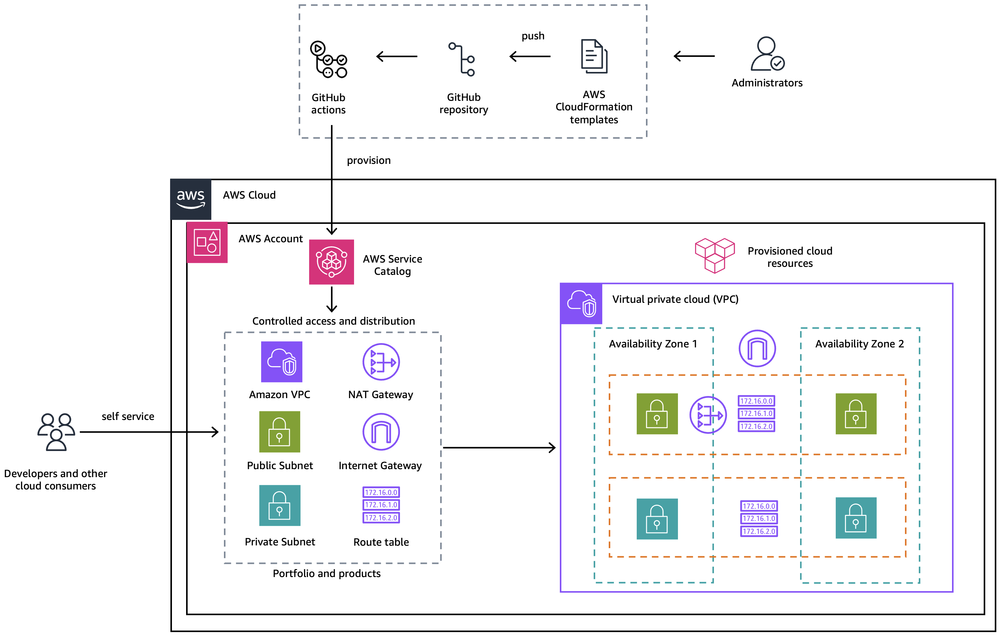

# AWS Service Catalog using reusable Github Actions

This repository contains the reusable Github Actions workflow for:
1. Provisioning AWS ServiceCatalog (SC) Portfolio 
2. Provisioning SC Product
3. Adding Launch Contraint
4. Portfolio Product Association
5. Portfolio Principal Association

The main workflow at `.github/workflows/workflow.yaml` has the `trigger` as `workflow_call`, which makes it possible to call this workflow from any other workflow. 
For more detail please refer [Events that trigger workflows](https://docs.github.com/en/actions/writing-workflows/choosing-when-your-workflow-runs/events-that-trigger-workflows)

## Table of content
- [AWS Service Catalog using reusable Github Actions](#aws-service-catalog-using-reusable-github-actions)
  - [Table of content](#table-of-content)
  - [Prerequisites](#prerequisites)
  - [Setup](#setup)
  - [Architecture](#architecture)
  - [How to Use](#how-to-use)
  - [Best practices](#best-practices)
  - [Limitations](#limitations)
  - [Contributing](#security)
  - [License](#license)
  - [Contributors](#contributors)
 
## Prerequisites
- An active AWS account
- A Github Account
- A Github Repository created
- [OpenID connect configured in AWS](https://docs.github.com/en/actions/deployment/security-hardening-your-deployments/configuring-openid-connect-in-amazon-web-services)
- Basic understanding of AWS CloudFormation and AWS Service Catalog
- An AWS S3 bucket to hold the AWS CloudFormation templates

## Setup
This solution has a CloudFormation template called `vpc.yaml` under the `templates`; which creates an example default VPC, with a pair of public and private subnets spread across two Availability Zones. 
It deploys an internet gateway, with a default route on the public subnets. It deploys a pair of NAT gateways (one in each AZ), and default routes for them in the private subnets.

You can either update or replace this CloudFormation template based on the resources you need to provision using ServiceCatalog.

## Architecture

## How to Use
The reusable Github Actions workflow template `workflow.yaml` is available under the folder ".github/workflows". 
As this has been configured to trigger on `workflow_call`, we have another file called `e2e-test.yaml` to call/trigger the workflow. This workflow once executed will perform the below steps sequentially:
1. Checkout the current code - in order to read the files in the repository
2. Configure AWS Credentials - To establish connection between Github Actions and the target AWS account
3. Upload CLoudformation template to AWS S3 bucket - Uploads the CLoudformation template from `templates` folder to the AWS S3 bucket provided as input
4. Deploy AWS ServiceCatalog Portfolio and related rescources using AWS CloudFormation

A sample `vpc.yaml` CloudFormation template is available under `templates` folder. This folder has another CloudFormation template called `servicecatalog-portfolio.yaml`, which contains all the resources required to provision the ServiceCatalog Portfolio.

Steps to trigger the workflow:
1. Edit the `e2e-test.yaml` file and make sure to update/modify the inputs provided from line #13 to line #26.
2. Make sure to pass the right AWS Account ID and region as Inputs.
3. `s3BucketName` at line #20 should be updated (refer prerequisites)
4. Validate the `LaunchConstraintRole` and `PrincipalArn` values, update as necessary 
5. Update `filename` if you have updated or modified anything as described in the [setup](#setup) section above
6. As this `e2e-test.yaml` file has the "trigger" as `push`, the main workflow will trigger as soon as you push the changes to this file.

## Best practices
Please make sure to follow the recommended best practices, as this is not in the scope of this solution.
1. The Security best practices as prescribed by AWS for [Service Catalog](#https://docs.aws.amazon.com/servicecatalog/latest/adminguide/security-best-practices.html)
2. [Security hardening for GitHub Actions](#https://docs.github.com/en/actions/security-for-github-actions/security-guides/security-hardening-for-github-actions)

## Limitations
This reusable code has been tested only with GitHub Actions

## Security

See [CONTRIBUTING](CONTRIBUTING.md#security-issue-notifications) for more information.

## License

This library is licensed under the MIT-0 License. See the LICENSE file.

## Contributors
* Ashish Bhatt
* Ruchika Modi
